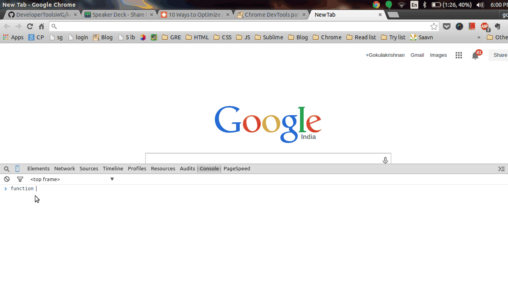

Google chrome is one of the fastest browser around and using chrome devTools for development is simply awesome. I use two chrome browers, one is normal <a class="link" target="_blank" href="https://www.google.co.in/chrome/">chrome</a> and other is <a class="link" target="_blank" href="http://www.google.co.in/intl/en/chrome/browser/canary.html">chrome canary</a>.

The difference is that canary is from future, that is new features will be available in canary before ported to actual chrome. Sometimes you may find break down, but that doesn't stop you from using it. For now canary is available for `Mac` and `Windows`. Enough with the explanation, let's get started.

## DevTools

In this post, all the tips and tricks mostly apply to `chrome canary`, if you don't find a menu or option in `actual chrome`. Download canary and try.

To access devTools in both chrome and canary, press `ctrl + shift + i` and in mac replace `ctrl` it with `command`.

### Inspect Element

Right click in the chrome to find `Inspect element` at the end of the menu.

Using it you can see default styles of a web page. We can even modify default styles and see the live changes (without refresh, else modified styles will be removed). Autocomplete styles are present by default. So changing the style is easier. See the below image.

### Pro Tips

Open the devTools

1. Change the css color property or background property in `styles tab` by pressing `shift + click` to change any `rgba`, `rgb`, `hex`, `hsl` to `rgba`, `rgb`, `hex`, `hsl`.

2. Just type in 'styles tab' to show autocomplete property name and its possible values

3. To add an attribute to an HTML element, right click in 'element panel' and select `add attribute` and for editing the HTML element, use double click or right click and select `edit as HTML`.

4. To see the styles applied to an element in the box model. (ie) content, padding, border, margin go to the bottom of `styles tab`.

5. To copy an HTML code, right click on `element tab` and select `copy as HTML` or simply drag and drop in any editor. See an example below.

### Console

The console tab is used to debug javascript. That's not all, you can write
javascript to the console just like you do in the javascript file and execute it. Let us see an example

In the above screen shot, I have executed a simple function which will alert hi. Other than writing javascript function, we can see `XMLHttp Requests`, `timestamps` of a log, `preserving the log` (ie) even on refresh log won't be cleared. Go to setting and select general menu and go to bottom to set any of the above menus.

### Pro Tips

DOM inspection is also possible in the console tab.

1. Using `$('elementName')` will return the list of matching element from DOM which is same as `document.querySelector`. On the result, right to find menu `Reveal in Elements Panel` to see the HTML element in elements panel.

2. Using `$('#somename')` will return id matching element from DOM which is same as `document.getElementById`.

Here is an example

<a class="link" target="_blank" href="https://developer.chrome.com/devtools/docs/commandline-api">Go here</a> to see all command line api for chrome console.

### Must have chrome extensions for developers:

1. <a class="link" target="_blank" href="https://chrome.google.com/webstore/detail/postman-rest-client/fdmmgilgnpjigdojojpjoooidkmcomcm?hl=en">Postman</a> is a tool to make REST-API calls.

2. <a class="link" target="_blank" href="https://chrome.google.com/webstore/detail/dimensions-legacy/hdmihohhdcbejdkidbfijmfehjbnmifk?hl=en">Dimension</a> a tool to test responsive websites and offline webpages.

3. <a class="link" target="_blank" href="https://chrome.google.com/webstore/detail/requirify/gajpkncnknlljkhblhllcnnfjpbcmebm?hl=en">Requirify</a> is used to download libraries such as `jQuery`, `Lo-Dash` etc.. to the console.

4. <a class="link" target="_blank" href="https://chrome.google.com/webstore/detail/whatfont/jabopobgcpjmedljpbcaablpmlmfcogm">WhatFont</a> to see the fonts used by the websites on mouse hover.

5. <a class="link" target="_blank" href="https://chrome.google.com/webstore/detail/eye-dropper/hmdcmlfkchdmnmnmheododdhjedfccka">Eye Dropper</a> allow you to pick colors from web pages. (inbuilt in canary)

6. <a class="link" target="_blank" href="https://chrome.google.com/webstore/detail/page-ruler/jlpkojjdgbllmedoapgfodplfhcbnbpn?hl=en">Page Ruler</a> lets to draw a ruler on any sites to show height, width and other properties.

I hope this post will be helpful to learn few basics about chrome devTools. Soon I will come back with an advanced tutorial for chrome devTools like finding memory leak, profiling etc. So stay tuned.

If you like my post share it or leave a comment.
