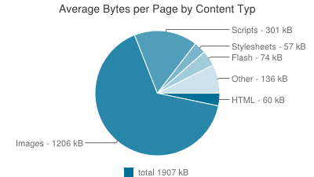
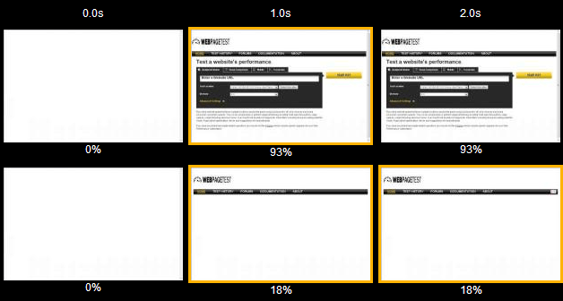

An average user stays in your site if the page loads in < 1000ms. In 2014, an average page size is 1.9MB. See the below chart for more stats.



via source <a target="_blank" href="http://httparchive.org/interesting.php#bytesperpage">httparchive</a>

The core content of site should render with in `1000ms`. If it fails, then the user is never gonna come back to your site again. By improving page load time, the revenue and downloads increased tremendously for many popular companies.

- Let's take <a target="_blank" href="http://www.walmart.com/">Walmart</a> for every `100ms` of improvement to their site, they grew revenue up to `1%`

- <a target="_blank" href="https://www.Yahoo.com">Yahoo</a> traffic increased by `9%` for every `400ms` of improvement.

- <a target="_blank" href="https://www.Mozilla.com">Mozilla</a> speed up their site by `2.2sec` gave them `160 million` more firefox downloads/year.

#### Steps involved in site optimization

1. Set performance budget.

2. Measuring the current performance.

3. Find the problem causing performance issue.

4. And finally yay, optimize it.

There are several ways to optimize your site, Lets see about it

## Speed Index

Speed index is the average time at which visible parts of page is <a href="http://www.html5rocks.com/en/tutorials/internals/howbrowserswork/#Painting" title="Browser Painting">painted</a> in the browser. Expressed in milliseconds and also depends on the viewport size. See below image ( video frames to show web page load at seconds ).

<i>Lower speed index score is the better score.</i>




Speed index can be measured by using <a target="_blank" href="http://www.webpagetest.org/">Webpagetest</a> (maintained by google).

#### TL;DR

Webpage test has lots features like running multiple test in different locations using different browsers. And can measure other metrics like load time, number of DOM elements, first byte time etc..

Eg: checkout the measured result of amazon <a target="_blank" href="http://www.webpagetest.org/result/141126_29_DVN/">here</a> using webpagetest.

<i>Watch the below video by <a href="http://blog.patrickmeenan.com/" target="_blank">Patrick Meenan</a> to know more about webpagetest</i>

<iframe style="margin: 0 auto;text-align: center;width: 100%;border: 1px solid #000;" width="560" height="315" src="//www.youtube.com/embed/euVYHee1f1M" frameborder="0" allowfullscreen></iframe>


## Render Blocking

If you know how a browser works, then you know about how `HTML, CSS, JS` are parsed by browser and which is blocking the rendering of the page. If you don't, see the below simple diagrammatic representation below.


Read more about <a target="_blank" href="www.html5rocks.com/en/tutorials/internals/howbrowserswork/">how a browser works</a> written by <a target="_blank" href="http://www.html5rocks.com/en/profiles/#taligarsiel">Tali Garsiel</a> and <a target="_blank" href="http://www.paulirish.com/">Paul Irish</a>.

### Steps involved in rendering in a browser

1. First browser parses `HTML` markup to construct `DOM tree` ( DOM = Document Object Model )

2. Then parses `CSS` to construct `CSSOM tree` ( CSSOM = CSS Object Model )

3. Before combining both DOM and CSSOM tree to contruct Render tree, `JS` files are parsed and executed.

Now you understood how parsing is done in a browser. Lets see which is blocking the construction of rendering tree.

## Render-Blocking CSS

CSS is treated as render blocking. For the construction of CSSOM, all the CSS are downloaded regardless of whether they are used in current page or not.

To solve this render-blocking, go through below steps

1. Inline the critical CSS, that is most important styles used by page above the fold in head tag inside `<style></style>`

2. Remove the unused CSS.

So how do I find unused CSS.

1. Use <a target="_blank" href="https://developers.google.com/speed/pagespeed/insights/">Pagespeed Insight</a> to get stats like unused CSS, render-blocking CSS and JS files etc.

	Eg: Flipkart's Pagespeed Insight result <a target="_blank" href="https://developers.google.com/speed/pagespeed/insights/?url=Flipkart.com">here</a>.

2. Gulp tasks like <a href="https://www.npmjs.com/package/gulp-uncss" target="_blank">gulp-uncss</a> or use Grunt tasks like <a href="https://github.com/addyosmani/grunt-uncss" target="_blank">grunt-uncss</a>. If you don't no what is grunt or gulp, read my <a href="{{ site.baseurl }}/2014/10/27/Task-Automation-using-grunt-and-gulp/">previous post</a>.

#### ProTips

1. Use <a href="http://cssstats.com/" target="_blank">CSS Stats</a> to get total no of elements used, no of unique styles, fonts etc.

2. Pagespeed Insight <a target="_blank" href="https://chrome.google.com/webstore/detail/pagespeed-insights-by-goo/gplegfbjlmmehdoakndmohflojccocli?hl=en">Chrome Extention</a>.

3. Tag Counter <a target="_blank" href="hhttps://chrome.google.com/webstore/detail/tagcounter/okjmidhcodkplbehcomejnfjlkbdnjlg">Chrome Extention</a>.

### Render-Blocking Javascript

If the browser encounter's javascript while parsing the `HTML markup`, the parsing is stopped. Only after executing the script, the HTML rendering will be continued. So this block's the `rendering of the page`.

To solve this

Use `async` or `defer` attribute in `<script></script>` tag.

1. `<script async>` will download the file during the `HTML parsing` and execute it as soon as the file is downloaded.

2. `<script defer>` will download the file during the `HTML parsing` and will execute it after `HTML parsing` is completed.

Eg: `async and defer` both are used in Google Analytics

Browser support for <a target="_blank" href="http://caniuse.com/#search=async" title="async browser support">async</a> and
<a target="_blank" href="http://caniuse.com/#search=defer" title="defer browser support">defer</a>.

## Memory Leaks

`Memory leaks` and <a href="http://en.wikipedia.org/wiki/Bloating" title="bloating" target="_blank">Bloat</a> is one of the problems faced by web developers. Lets see how to find a memory leak and later solve them.

####  Lets find Memory Leak in Javascript####

1. Using Chrome Task Manager to check `memory used by app` as well `js memory` (total + live memory). If your memory keeps on growing on each action, then you can suspect there is a memory leak.

<i>See below the screenshot of Chrome Task Manager</i>


#### Chrome DevTools Profiling

Use `Heap Profiler` to find memory leak. Open chrome devTools and go to profiles tab and select take heap snapshot.
If you don't know about chrome DevTools, read my <a target="_blank" href="https://gokulkrishh.github.io/2014/09/12/Chrome-DevTools/" title="Chrome DevTools"> previous post</a>.

<i>Screenshot for Chrome DevTools Profiler</i>


#### The Heap Profiler has 4 snapshot views

1. Summary View - To show total number of objects allocated and its instance, `Shallow Size` (size of the memory of obj itself) and `Retained Size` (size of the memory that will be freed once automatic GC happens + unreachable object).

2. Comparison View - To compare two or more snapshots before and after a operation to check memory leak.

3. Containment View - To show overall view of your app object structure + DOMWindow Objects (that is global obj's), GC roots, Native objects (from the browser).

4. Dominators View - This will show the <a target="_blank" href="https://developer.chrome.com/devtools/docs/memory-analysis-101#dominators" title="dominators">dominators</a> tree of a heap graph.

Read more in detail about <a target="_blank" href="https://developer.chrome.com/devtools/docs/heap-profiling" title="Chrome devtools heap profile">Heap profiler</a>.

#### DOM Leak

Reference to `DOM elements` causes DOM Leak and prevents automatic garbage collection(GC) process.

Lets see an example

```html
<div id="container">
  <h1 id="heading">I am just a heading nothing much</h1>
</div>
```

```js
var parentEle = document.getElementById('container'); //get parent ele reference
var headingEle = document.getElementById('heading'); //get child ele reference
parentEle.remove(); //removes parent element from DOM
//but its child ref still exist, So parentEle won't collect GC'd and causes DOM Leak
```

Let's fix this DOM leak by making its reference `null`

```js
headingEle = null; //Now parentEle will be GC'd
```

The above are common problems faced by web developers. Thats all for today. If you like my post share it or have a doubt comment below. Thanks!!
