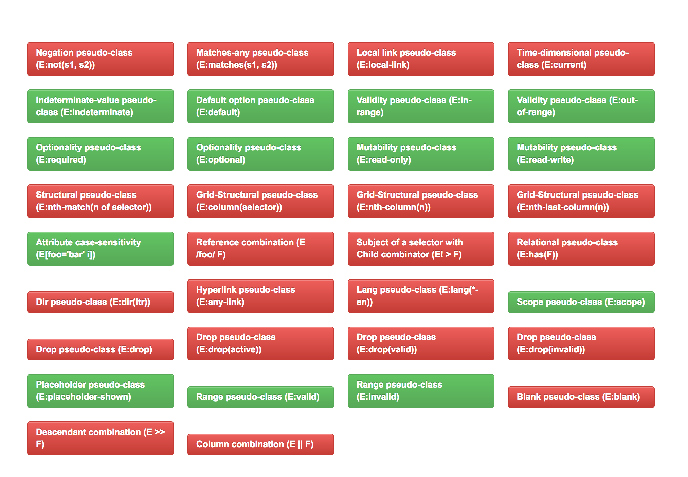

A CSS selector is like patterns which are used to select and style the pattern matching elements. We will compare `CSS3` with `CSS4` selectors and give some examples for better understanding.

## Pseudo Class

Pseudo class in CSS is used to defined a special state of an element. Such as visited links have the state of `:visited`.

## CSS3

### :not()

`:not` pseudo class selector is used to select all the elements except the one which is specified in the argument.

```html
<a href="/" class="link">Link 1</a>
<a href="">No Link</a>
<a href="" rel="nofollow">No Follow</a>
<a href="/" class="link">Link 2</a>
```

We have 4 `<a></a>` tags, two with a class `link` and one with `rel` attribute and one normal link.

So lets set the color of all the anchor tags to <span class="color__red">`red`</span> expect the one's which has class `.link`.

```css
a:not(.link) {
  color: red;
}
```

### Example:

<p data-height="265" data-theme-id="dark" data-slug-hash="NdmWWz" data-default-tab="html,result" data-user="gokulkrishh" data-embed-version="2" data-pen-title="CSS3 :not selector" class="codepen">See the Pen <a href="http://codepen.io/gokulkrishh/pen/NdmWWz/">CSS3 :not selector</a> by Gokulakrishnan Kalaikovan (<a href="http://codepen.io/gokulkrishh">@gokulkrishh</a>) on <a href="http://codepen.io">CodePen</a>.</p>

In above example, I don't want to set the color to <span class="color__red">`red`</span> for `rel="nofollow"`. But `CSS3` :not() selector allows only one argument.

Now let us see in <b>CSS4</b>.

## CSS4

### :not()

Allows setting multiple arguments for the `:not(selector1, selector2)` pseudo class selector.

```css
a:not(.link, [rel="nofollow"]) {
  color: red;
}
```

The above example will let me to set the color of `<a></a>` tags to <span class="color__red">`red`</span> which doesn't have `.link` class and `rel=nofollow` attribute.


### :matches()

Takes multiple arguments and represents an element which is specified in the argument.

Example:

```html
<header>
  <h1>Header Title</h1>
</header>

<h1>General Title</h1>

<div class="container">
  <h1>Container Title</h1>
</div>

<section>
  <h1>Section Title</h1>
</section>
```

Now I want to change the color of some `<h1></h1>` tags to <span class="color__green">`green`</span>. Normally we write it likes.

```css
<!-- Normal Way -->
header h1, .container h1 {
  color: green;
}

<!-- CSS4 -->
:matches(header, .container) h1 {
  color: green;
}
```

### List of some CSS4 selectors.

| Selectors                                                                     | Does              | CSS      |
| -------------                                                                 |:--------------------------|---------:|
| <a href="https://www.w3.org/TR/selectors4/#negation">:not(s1, s2, s3)</a>     | Allows multiple arguments | 3/4      |
| <a href="https://www.w3.org/TR/selectors4/#matches">:match(s1, s2)</a>              | Matches the elements specified in the arugment       |   4     |
| <a href="https://www.w3.org/TR/selectors4/#attribute-case">a[href=home i]</a> | Case Insensitive (home, HOME, Home etc,.)      |    4     |
| <a href="https://www.w3.org/TR/selectors4/#any-link-pseudo">:any-link</a>     | Matches source of hyperlink (a, link etc,.)      |    4     |

### Browser Support:

Only `38%` of CSS4 selectors are supported by the browsers.



<center><i>Source <a href="http://css4-selectors.com/browser-selector-test/" target="_blank">Browser Selector Test</a></i></center>

### Conclusion

There are close to 22 new CSS level 4 selectors. Some of them are really cool and let us write less CSS code. But like mentioned above not all the browsers supports the level 4 selectors. Thanks for reading and see you in my next blog post. If you like my post, share it or comment below.

#### Articles

- <a href="https://www.w3.org/TR/selectors4" target="_blank">Full list of CSS4 selectors</a>
- <a href="http://css4.rocks/" target="_blank">CSS4 Rocks</a>

<script async src="https://production-assets.codepen.io/assets/embed/ei.js"></script>

<p> Thanks for reading my blog post 😁</p>
