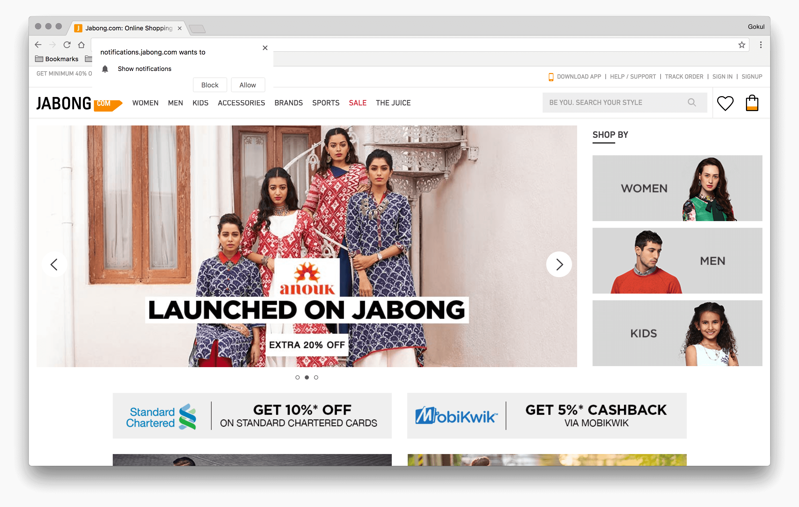
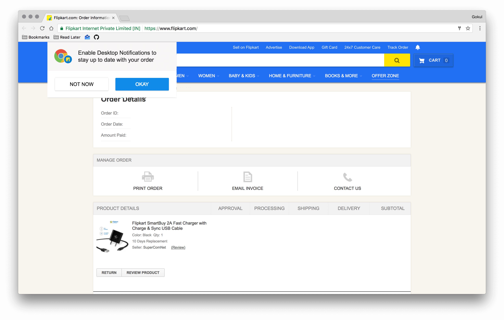
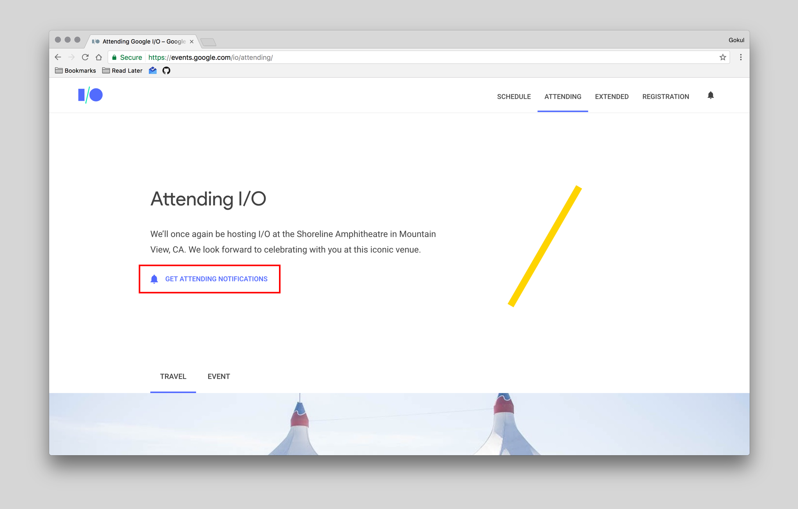
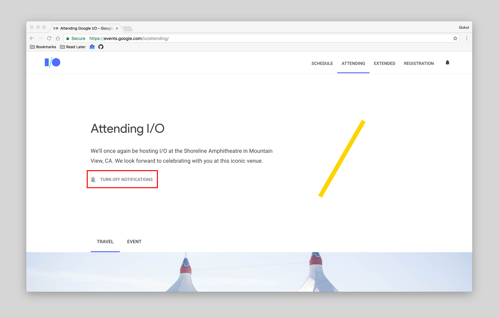

As the web is moving forward very fast and now we can do almost everything on the web which can be done in native applications (`android` & `iOS`). Such as `offline contents`, `push notifications`, `background sync` etc.

But many websites started using these features in a bad way and only a few sites are using it in better ways to engage users.

In this post, I will explain `why` and `when` you `should` and `shouldn't` prompt for push notifications.

### Good & Bad timing for asking permission

### Bad

- Asking for permission on the `first visit` (this pattern is repeated in most of the sites)

<i>jabong.com</i>

 

### Good

- Ask for permission when it is `relevant`.

#### Example:

After ordering something, prompt the user that you will give order status using push notifications.

<i>Flipkart Website</i>

 

### Bad

- Showing push notification `permission prompt` on every page load.

### Good

- Show an option to `enable` push notification for certain categories. Let the user decide whether he/she wants the push notifications.

#### Example:

<a href="https://events.google.com/io/attending/" target="_blank">Google I/O 2017</a> site has options to enable for `attendees i/o notifications`.

<i>Google I/O 2017 site</i>

 

### Bad

- No option to `disable` the enabled push notifications.

### Good

- Give the power to the user to `disable` notifications, so he/she can disable it when no longer needs it.

<i>Google I/O 2017 site</i>

 

#### Browser Support

- Chrome

- Opera

- Mozilla Firefox

Above browsers support push notifications in both `desktop` & `mobile`.

### Conclusion

As a user just like you, I get irritated whenever I see the push notification prompt on unwanted times and on every page load.

So once the user `blocks` the permission, there is no way to ask for permission again unless user clears the site cache. So focus on the user and show permission prompt only when it is `relevant`. Thanks for reading my post. See you in next post :)

#### References & Articles

- <a href="https://web-push-book.gauntface.com/" target="_blank">Web Push Book
</a>

- <a href="https://tests.peter.sh/notification-generator/" target="_blank">Push Notification Generator
</a>

- <a href="https://demopwa.in" target="_blank">Demo PWA</a>

Thanks for reading my blog post 😁.
