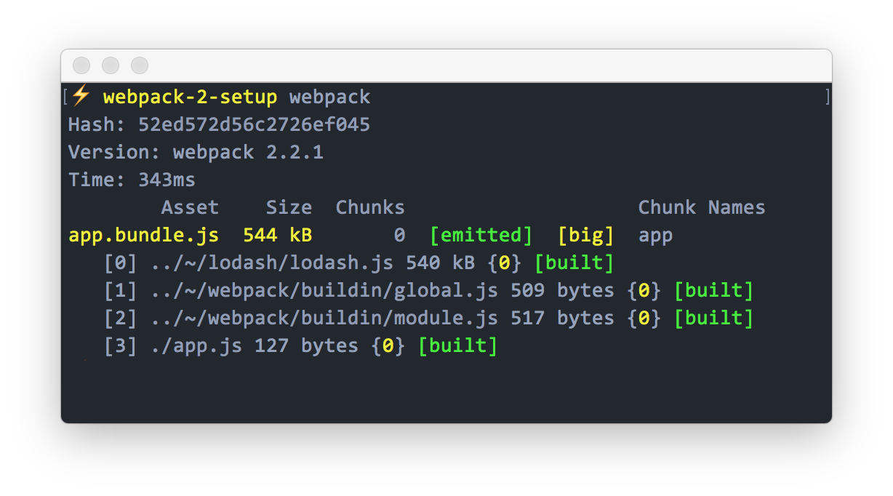
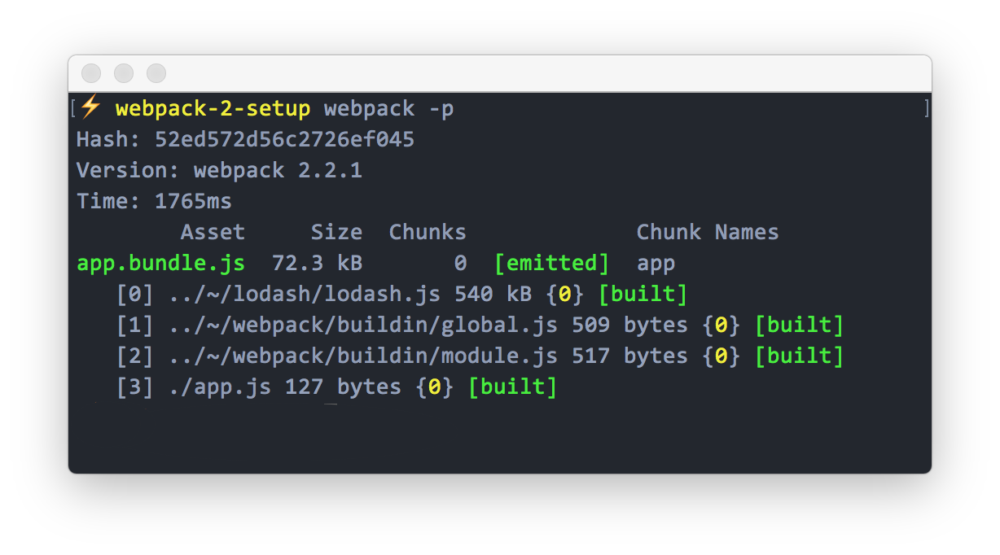

[Webpack](https://webpack.js.org/) is module bundler for modern web applications.

- It is a highly configurable and easy to use.
- Reduces the network request by bundling all static assets into a single file.
- <a href="https://github.com/webpack/docs/wiki/hot-module-replacement-with-webpack" target="_blank">Hot Reloading</a> helps us to forget about the good old <b>gulp</b> and <b>grunt</b> watchers (we won't be talking about this).

## Steps

1. [Create folder](#step-1---create-a-folder)
1. [Install webpack](#step-2---install-webpack)
1. [Creating webpack config](#step-3---creating-webpack-config)
1. [Run webpack](#step-4---run-webpack)
1. [Webpack development server](#step-5---setup-webpack-development-server)
1. [Run development server](#step-6---run-development-server)
1. [Development & production env](#step-7---development--production-environment)
1. [Sourcemap for development & production](#step-8---sourcemap-for-development--production)

### Step 1 - Create a folder

Create a folder called ```webpack-2-setup``` and cd into it.

```bash
$ mkdir webpack-2-setup && cd webpack-2-setup
```

### Step 2 - Install webpack

```bash
$ npm install --save-dev webpack@latest webpack-dev-server@latest
```

or do it via [Yarn](https://yarnpkg.com/).

From now on, I will be using `yarn` to install our dependencies.

```bash
$ yarn add --dev webpack@latest webpack-dev-server@latest
```

### Step 3 - Creating webpack config

Create a ```webpack.config.js``` file in the root of our directory and let's write some configuration.

```js
var webpack = require('webpack');

var config = {
  context: __dirname + '/src', // `__dirname` is root of project and `src` is source
  entry: {
    app: './app.js',
  },
  output: {
    path: __dirname + '/dist', // `dist` is the destination
    filename: 'bundle.js',
  },
};

module.exports = config;
```

Create `src/` directory as well. Now lets add [lodash](https://lodash.com) to dependencies in ```package.json``` by.

```bash
$ yarn add --dev lodash
```

And create a file called `app.js` in `src/` directory.

```js
var _ = require('lodash');

var array = [1];
var other = _.concat(array, 2, [3], [[4]]);

alert(other); // [1, 2, 3, [4]]
```

### Step 4 - Run webpack

To run webpack in `development mode`, type the following in your terminal.

```bash
$ webpack
```

*Screenshot for development mode.*

<center> </center>

<b>bundle size:</b> 544 KB

To run webpack in ```production mode```, type the following in your terminal.

```bash
$ webpack -p
```

- <b>-p</b> is for production which uglify and minify the files.
- <b>bundle.js</b> is our bundled file which is added to `dist/` directory.

*Screenshot for production mode.*

<center>  </center>

<b>bundle size:</b> 72.3 KB

We need a `local server` to run our application. So let's setup a development server.

### Step 5 - Setup webpack development server

Webpack has its own development server. Let's add it to the ```webpack.config.js``` configuration.

```js
var config = {
  devServer: {
    contentBase: __dirname + '/src', // `__dirname` is root of the project
  }
}
```

And add the script ```bundle.js``` file in ```src/index.html``` like below.

```html
<!DOCTYPE html>
<html>
<head>
  <title>Webpack 2 Setup</title>
</head>
<body>

  <!-- bundler script file -->
  <script src="/bundle.js"></script>
</body>
</html>
```

### Step 6 - Run development server

```bash
$ webpack-dev-server
```

Open <a href="http://localhost:8080/" target="_blank">http://localhost:8080</a> in your browser.

<i>Screenshot for development server running in browser.</i>

<center>  </center>

More [configuration details](https://webpack.js.org/configuration/dev-server/) on webpack-dev-server. That's all, the basic webpack configuration is done.

But what about ```ES6``` support? How to setup that? Let us see.

## Loaders

A Loader is a task in webpack, which allows to `require()` CSS files in javascript or convert an image into data-URLs etc,

We are going to set up ```ES6 + Babel``` using a webpack babel loader.

### Step 1 - Install babel loader & ES6 preset.

```bash
$ yarn add --dev babel-loader babel-core babel-preset-es2015
```

Now we have to add loader configurations to ```webpack.config.js``` file.

### Step 2 - ES6 loader

```js
module: {
  rules: [
    {
      test: /\.js$/, // Check for all js files
      exclude: /node_modules/,
      use: [{
        loader: 'babel-loader',
        options: { presets: ['es2015'] }
      }]
    }
  ]
}
```

Now, `ES6` syntax is supported, let us check by changing ```app.js``` to ES6.

```js
// importing lodash module
import _ from 'lodash';

const array = [1];
const other = _.concat(array, 2, [3], [[4]]);

alert(other); // [1, 2, 3, [4]]
```

Again run the development server and check.

```bash
$ webpack-dev-server
```

`ES6` support is added greatly. But we need a way to debug `bundle.js` file for development since it will be bundled into a small file. So that means we have to add a <a href="http://blog.teamtreehouse.com/introduction-source-maps" target="_blank">sourcemap</a>.

Before adding sourcemap, how do you tell which in mode webpack is running? So for that, we need to an environment for production and development.

### Step 7 - Development & Production environment

In `package.json` file, let's add scripts to run our dev server and production.

```json
"scripts": {
  "start": "webpack-dev-server",
  "build": "NODE_ENV=production webpack -p --config webpack.config.js"
}
```

By setting `NODE_ENV` in the build script, we can access it in `webpack.config.js` and add configurations accordingly.

### Step 8 - Sourcemap for development & production

Now we know when we are running for production or development. Let us use it to set up the sourcemap accordingly.

```js
var config = {
  devtool: "eval-source-map" // Default development sourcemap
};

// Check if build is running in production mode, then change the sourcemap type
if (process.env.NODE_ENV === "production") {
  config.devtool = ""; // No sourcemap for production

  // Add more configuration for production here like
  // SASS & CSS loaders
  // Offline plugin
  // Etc,
}

module.exports = config;
```

More information on webpack's <a href="https://webpack.js.org/configuration/devtool/#devtool" target="_blank">sourcemaps</a>.

## Final

Below code contains all the configurations for the webpack from above steps.

```js
var webpack = require('webpack');

var config = {
  context: __dirname + '/src', // `__dirname` is root of project and `src` is source

  entry: {
    app: './app.js',
  },

  output: {
    path: __dirname + '/dist', // `dist` is the destination
    filename: 'bundle.js'
  },

  //To run development server
  devServer: {
    contentBase: __dirname + '/src',
  },

  module: {
    rules: [
      {
        test: /\.js$/, // Check for all js files
        exclude: /node_modules/,
        use: [{
          loader: 'babel-loader',
          options: { presets: ['es2015'] }
        }]
      }
    ]
  },

  devtool: "eval-source-map" // Default development sourcemap
};

// Check if build is running in production mode, then change the sourcemap type
if (process.env.NODE_ENV === "production") {
  config.devtool = ""; // No sourcemap for production

  // Add more configuration for production here like
  // Uglify plugin
  // Offline plugin
  // Etc,
}

module.exports = config;
```

#### Articles References:

- <a href="https://blog.flennik.com/the-fine-art-of-the-webpack-2-config-dc4d19d7f172#" target="_blank">The Fine Art of the Webpack 2 Config</a>
- <a href="https://www.sitepoint.com/beginners-guide-to-webpack-2-and-module-bundling" target="_blank">A Beginners Guide to Webpack 2 and Module Bundling</a>
- <a href="https://github.com/webpack-contrib/awesome-webpack" target="_blank">A curated list of awesome webpack resources, libraries and tools.</a>

Thanks for reading my article.
