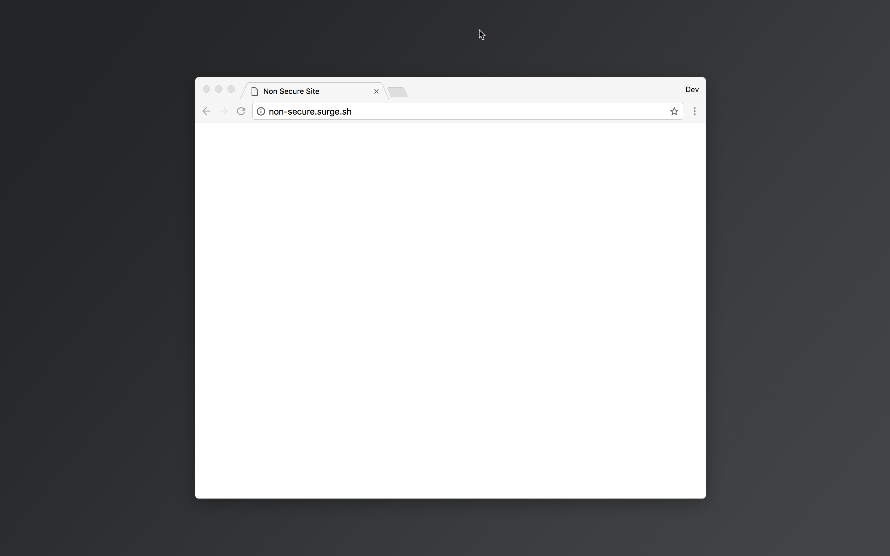
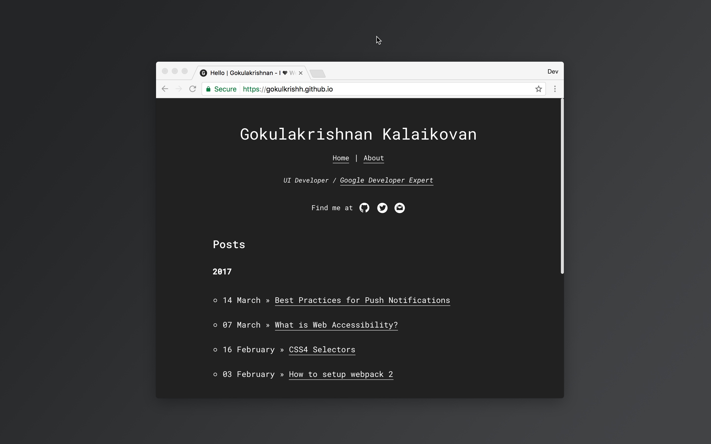
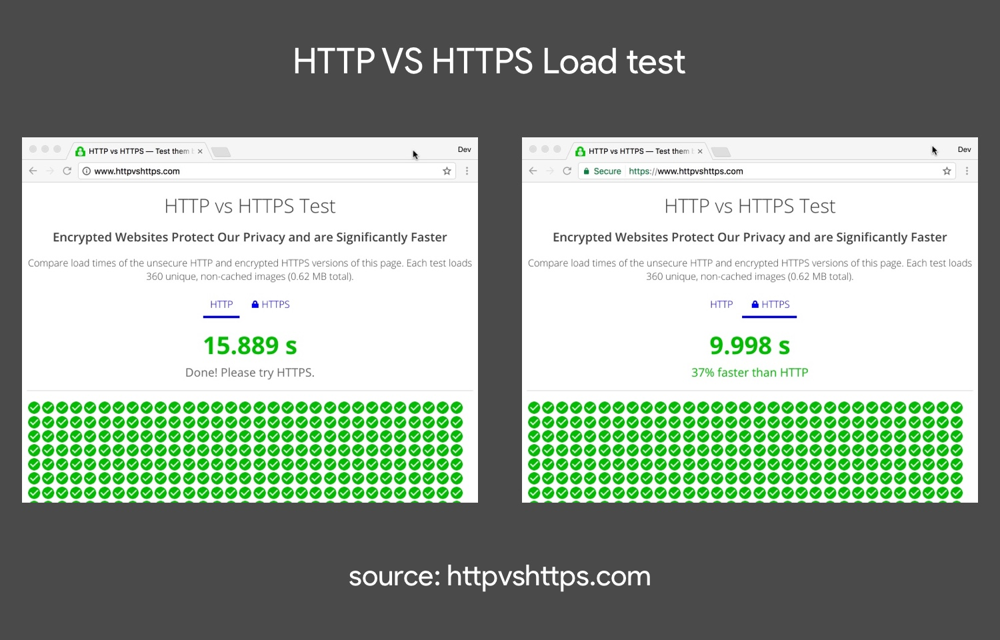
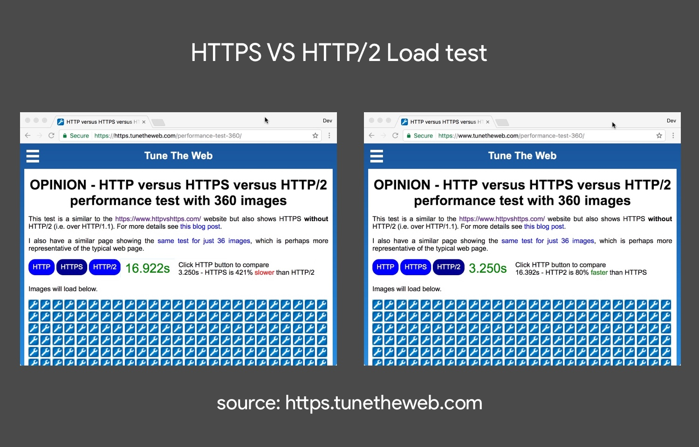

This comparison blog post is to show <b>why you should move</b> from <b>HTTP</b> to <b>HTTPS</b> and why you should <b>add support</b> to <b>HTTP/2</b>. Before comparing <b>HTTP</b> vs <b>HTTP/2</b>. Lets see what is <b>HTTP</b> first.

## Hypertext Transfer Protocol (HTTP)

HTTP is the set of rules for communication on the World Wide Web (www). HTTP is an <b>application protocol</b> which runs on top of the <b>TCP/IP</b> layer. When a user requests a web page in the browser, HTTP takes the request and establish the connection between the web server and a client.

### Points to note

- HTTP is <b>Synchronous</b>.

- Data sent over HTTP are via <b>plan text</b>. Thus not secure. Man in the middle attack is possible.

- <b>Multiple TCP connections</b>: increase in number of round trips for multiple TCP connections.

- HTTP is <b>stateless protocol</b>, because each command is executed separately without the knowledge of the previous command.

  <i>site using http (non-secure)</i>
  

## Hypertext Transfer Protocol Secure (HTTPS)

<b>HTTPS</b> is the secured version of the <b>HTTP</b>. Communication between web server and the client are encrypted by <b>Transport Layer Security</b> (TLS) or by <b>Secure Socket Layer</b> (SSL).

  <i>site using https (secure)</i>
  

### HTTP vs HTTPS test

Each test loads 360 unique, non-cached images (0.62 MB total). After multiple tests, HTTPS were able to load <b>37%</b> faster than unsecured HTTP. One more reason to move from HTTP to HTTPS.

  <i>Results</i>
  

### Points to note

- <b>Secure connection</b>. All the data sent over HTTPS are encrypted.

- <b>Loads faster</b> than the unsecured HTTP.

- <b>Service Workers</b>, <b>Geo Location</b>, <b>Camera API</b> etc are <b>only supported</b> in HTTPS.

## Hypertext Transfer Protocol 2 (HTTP/2)

<b>HTTP/2</b> is next version of <b>HTTP</b>. HTTP/2 solves many of the <b>HTTP/1.1</b> problems.

### Points to note

- <b>Single TCP connection</b>: Thus less number of round trips for TCP connections.

- <b>Binary</b>: Server can parse easily without the need for converting from text to binary.

- <b>Multiplexing</b>: Can make multiple requests at the same time (max of 6 - 8)

- <b>Header Compression</b>: HTTP header size is compressed thus size is reduced.

- <b>Server Push</b>: Server can send resources to the client which was not yet requested.

- <b>Request Prioritization</b>: Each request can be prioritized to request more important resources first.

### HTTPS vs HTTP/2 test

This test is similar to the previous test but with HTTP/2 support. Each test loads 36 unique, non-cached images (292 KB total). After multiple tests, HTTP/2 were able to load <b>80%</b> faster than <b>HTTPS</b>.

  <i>Results</i>
  

### Browser Support for HTTP/2

  <i>source: caniuse.com</i>
  <iframe class="iframe__http2-support" src="https://caniuse.bitsofco.de/embed/index.html?feat=http2&periods=future_1,current,past_1,past_2%22" frameborder="0"></iframe>

  <i>embed: <a target="_blank" href="https://github.com/ireade/caniuse-embed">caniuse-embed</a></i>

### CDN's which supports HTTP/2

- <a href="https://www.cloudflare.com/website-optimization/http2/">cloudflare</a>

- <a href="https://www.maxcdn.com/blog/http2-support/" target="blank">maxcdn</a>

- <a href="https://www.keycdn.com/blog/keycdn-http2-support/" target="blank">keycdn</a>

## Conclusion

HTTP/2 let us increase the performance of our site without any need for shredding, spriting, concatenating etc. This doesn't mean that we shouldn't do all that. But it clearly shows us the importance of moving from HTTP/1.1 to HTTP/2.

Thanks for reading my post. If any questions comment below or if you liked my post share it 😃
